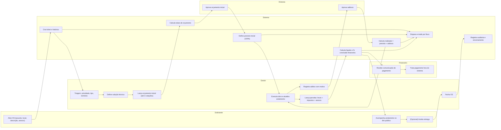

# Fluxo Operacional OS-CHRISTUS (Raia por Papel)

Este documento descreve o ciclo completo da OS, da abertura ao encerramento, indicando quem atua em cada ponto.

## Papéis (raias)
- Solicitante: abre chamado e acompanha andamento sem acesso a valores financeiros.
- Gestor: conduz triagem, solução, orçamento, execução e atualização financeira no sistema.
- Diretoria: aprova decisões de orçamento e aditivos quando houver ação de diretoria.
- Financeiro: recebe comunicações de pagamento e opera fora do sistema quando aplicável.
- Sistema: calcula valores, registra histórico/auditoria e dispara comunicações.

## Fluxo ponta a ponta

1. Abertura da OS
- Quem entra: Solicitante ou equipe interna.
- O que faz: informa assunto, local, descrição e anexos.
- Sistema: cria ticket em `Nova OS`, registra histórico e dispara e-mail do fluxo do solicitante.

2. Triagem
- Quem entra: Gestor.
- O que faz: classifica prioridade (`Trivial`, `Alta`, `Urgente`), tipo e território (região/sede), define encaminhamento técnico.
- Sistema: atualiza status e trilha de auditoria.

3. Solução técnica
- Quem entra: Gestor / responsável técnico.
- O que faz: define solução e necessidade de orçamento/terceiro.
- Sistema: move para fluxo de orçamento.

4. Orçamento inicial
- Quem entra: Gestor.
- O que faz: cadastra até 3 cotações, separando `Mão de Obra` e `Material`, com `Custo Unitário x Quantidade`.
- Sistema: calcula total de mão de obra, total de material e total da obra; exibe quantidade de cotações dinamicamente (2 ou 3).

5. Aprovação de orçamento
- Quem entra: Diretoria (quando houver ação de diretoria).
- O que faz: aprova/reprova orçamento.
- Sistema: valor aprovado vira `Previsto Inicial` (base de 100%).

6. Aditivos durante a obra
- Quem entra: Gestor cria, Diretoria aprova.
- O que faz: registra aditivo com motivo e cotação (1 cotação por aditivo).
- Sistema: soma os aditivos aprovados no realizado (`Realizado = Previsto Inicial + Aditivos`).
- Observação: podem existir múltiplos aditivos ao longo da OS.

7. Execução
- Quem entra: Gestor + equipe/terceiros.
- O que faz: executa serviço e atualiza andamento.
- Sistema: mantém timeline, anexos e histórico.

8. Financeiro e parcelas
- Quem entra: Gestor.
- O que faz: informa valor bruto da parcela, impostos e anexos da parcela.
- Sistema:
  - calcula líquido da parcela automaticamente;
  - acumula valor bruto pago;
  - calcula `% conclusão financeira = bruto acumulado / previsto inicial`;
  - percentual pode passar de 100%.

9. Comunicação por e-mail (3 fluxos)
- Solicitante: começa na abertura; acompanha andamento sem dados de orçamento/pagamento.
- Diretoria: começa quando há ação de diretoria (decisão), evitando spam.
- Financeiro: recebe apenas quando há ação de pagamento.
- Sistema: destinatários configuráveis em Configurações.

10. Link do solicitante
- Mostra: status e progresso da obra.
- Não mostra: valores e detalhes financeiros.
- Aceite: pode haver etapa de aceite no ponto configurado do fluxo.

11. Encerramento
- Quem entra: Gestor.
- O que faz: conclui OS após execução/aceite e pendências tratadas.
- Sistema: fecha chamado, registra checklist final e mantém auditoria.

## Diagrama (Mermaid)

